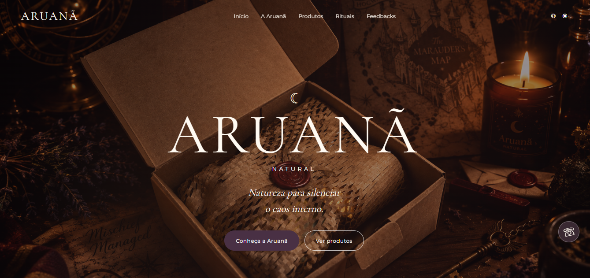

# 🕯️ Aruanã Natural

> Site desenvolvido para a Aruanã Natural, uma marca de produtos artesanais voltados para autocuidado, aromaterapia e bem-estar.



## 🌿 Sobre o projeto

O Aruanã Natural foi desenvolvido para criar a presença digital de uma marca de produtos artesanais.

O projeto começou como uma forma de apresentar a marca e seus produtos na internet, mas também foi utilizado para colocar em prática conhecimentos de desenvolvimento web e trabalhar com funcionalidades além de uma página institucional simples.

O resultado é um site responsivo, com catálogo de produtos, filtros, seção de rituais, avaliações, integração com banco de dados e uma área administrativa para gerenciamento dos feedbacks.

---

## ✨ Funcionalidades

- 🕯️ Apresentação da marca
- 🛍️ Catálogo de produtos
- 🔎 Filtros por categoria
- 🌙 Seção de rituais
- ⭐ Avaliações de clientes
- 💬 Carrossel de feedbacks
- 🔐 Painel administrativo
- ☁️ Integração com Supabase
- 📱 Layout responsivo
- 📲 Contato pelo WhatsApp
- 📷 Integração com Instagram
- ✨ Animações e efeitos de rolagem

---

## 💻 Tecnologias utilizadas

- HTML5
- CSS3
- JavaScript
- Supabase
- Git
- GitHub
- GitHub Pages

---

## 🧩 O que desenvolvi

Durante o desenvolvimento do projeto, trabalhei principalmente com:

- Estruturação das páginas utilizando HTML
- Criação da identidade visual utilizando CSS
- Desenvolvimento de layout responsivo
- Manipulação de elementos da página com JavaScript
- Criação de filtros e interações no catálogo
- Desenvolvimento do formulário de avaliações
- Criação do carrossel de feedbacks
- Integração com o Supabase
- Desenvolvimento da área administrativa
- Organização dos arquivos do projeto
- Publicação e manutenção do site

---

## ☁️ Integração com Supabase

O Supabase é utilizado para armazenar os feedbacks enviados pelos visitantes e controlar o acesso ao painel administrativo.

O fluxo funciona da seguinte forma:

```text
Visitante
   ↓
Envia uma avaliação
   ↓
Supabase
   ↓
Painel administrativo
   ↓
Aprovação
   ↓
Feedback exibido no site
```

Essa integração permitiu transformar o projeto em uma aplicação com dados armazenados externamente, indo além de um site composto apenas por páginas estáticas.

---

## 📁 Estrutura do projeto

```text
Aruana/
│
├── index.html
├── admin.html
├── README.md
├── .gitignore
├── CNAME
│
└── assets/
    ├── css/
    ├── js/
    └── images/
```

---

## 🌐 Projeto online

🔗 **[Acessar o Aruanã Natural](https://aruananatural.com.br)**

---

## 📚 O que aprendi

Este projeto foi uma oportunidade para aplicar na prática conhecimentos que venho desenvolvendo durante meus estudos.

Entre os principais aprendizados estão:

- Estruturação e organização de um projeto web
- Desenvolvimento de interfaces utilizando HTML e CSS
- Criação de layouts responsivos
- Utilização de JavaScript para criar interações
- Manipulação de elementos do DOM
- Organização de arquivos e código
- Integração com serviços externos
- Utilização do Supabase
- Trabalhar com dados enviados por usuários
- Criação de uma área administrativa
- Utilização do Git e GitHub
- Publicação de um projeto na internet
- Identificação e correção de problemas durante o desenvolvimento
- Manutenção e evolução de um projeto existente

---

## 🎯 Objetivo do projeto

Além de servir como presença digital para a marca, o projeto também foi desenvolvido como uma aplicação prática para evolução dos meus conhecimentos em desenvolvimento web.

A ideia foi trabalhar em um projeto que tivesse uma finalidade real e que pudesse continuar sendo aprimorado conforme meus conhecimentos evoluem.

---

## 🚧 Próximos passos

O projeto continua em evolução e algumas melhorias que pretendo implementar futuramente incluem:

- Melhorar ainda mais a experiência em dispositivos móveis
- Aperfeiçoar o painel administrativo
- Melhorar a organização e manutenção do código
- Adicionar novas funcionalidades ao catálogo
- Aprimorar a acessibilidade
- Melhorar o SEO e a indexação nos mecanismos de busca
- Continuar refinando a experiência do usuário
- Evoluir a estrutura do projeto conforme novos conhecimentos forem adquiridos

---

## 📌 Status

🟢 **Projeto publicado e em evolução.**

O site está disponível online e continua sendo utilizado como projeto de estudo e portfólio.

---

## 👨‍💻 Desenvolvido por Alisson Rodrigues

Este projeto faz parte do meu portfólio enquanto estudo **Análise e Desenvolvimento de Sistemas**.

A proposta é continuar desenvolvendo projetos práticos para transformar os conhecimentos adquiridos nos estudos em experiência real de desenvolvimento.

[](https://github.com/Son-Rodrigues)

---

⭐ Se este projeto foi útil ou interessante para você, fique à vontade para conhecer outros projetos no meu GitHub.